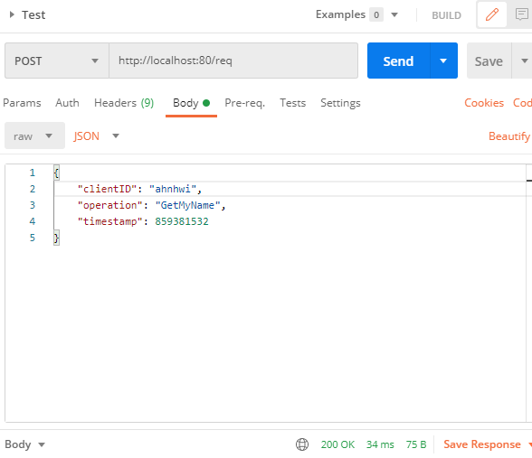

# Sample implementation of various consensus algorithms

## 사용법

### 서버 실행
```java
/* nodeId에 Apple, Google, MS, IBM을 각각 넣어서 4개의 노드를 생성해야 합의가 정상적으로 이루어짐 */
go run main.go [nodeId]

/* 아래처럼 나오면 서버 on 성공 */  
Server will be started at ...
```

### 요청 보내기

header의 Content-Type을 application/json으로 설정해주고  
아래와 같이 body를 구성하여 url로 POST 요청  
API endpoint의 종류는 다음과 같음  
1. /req



## PBFT
### Architecture
#### Overall behavior (4 peers)

Definitions of each abbreviation in the diagram are;

* `m`: Request message object
* `c`: Client ID
* `t`: Timestamp
* `v`: View ID
* `n`: Sequence ID
* `i`: Peer(Node) ID
* `r`: Result of the request's operation

##### Why `count >= 2` ?
In the diagram, the peer change its state to `prepared` or `committed` when the `count` value, which is the number of verified messages from other peers, is larger than `2`.
Actually, the condition is `count >= 2*f` where `f` is the maximum number of faulty peers, which the network can tolerate. In this case, `f` is just `1`, so the condition is `count >= 2`. 

##### What is the reply message?
Every node replies the result of the request's operation to the client individually. The client will collect these reply messages and if `f + 1` valid reply messages are arrived, the client will accept the result.
In this sample implementation, there is no client. So, every node including the primary will return its reply message to the primary.

#### Code structure of the implementation


### Working Screenshot


## License
Apache 2.0
